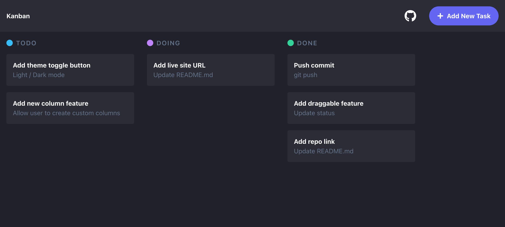

# Kanban

This is a minimalistic kanban board.



## How To Use

```bash
git clone https://github.com/tomwf/kanban
```
Navigate into the directory:
```bash
cd kanban
```
Install the dependencies:
```bash
npm i
```
Run the local dev environment:
```bash
npm run dev
```
Open your browser and visit:
```
http://localhost:5000
```

## Link

Live Demo: [Kanban](https://tomwf-kanban.herokuapp.com/)
